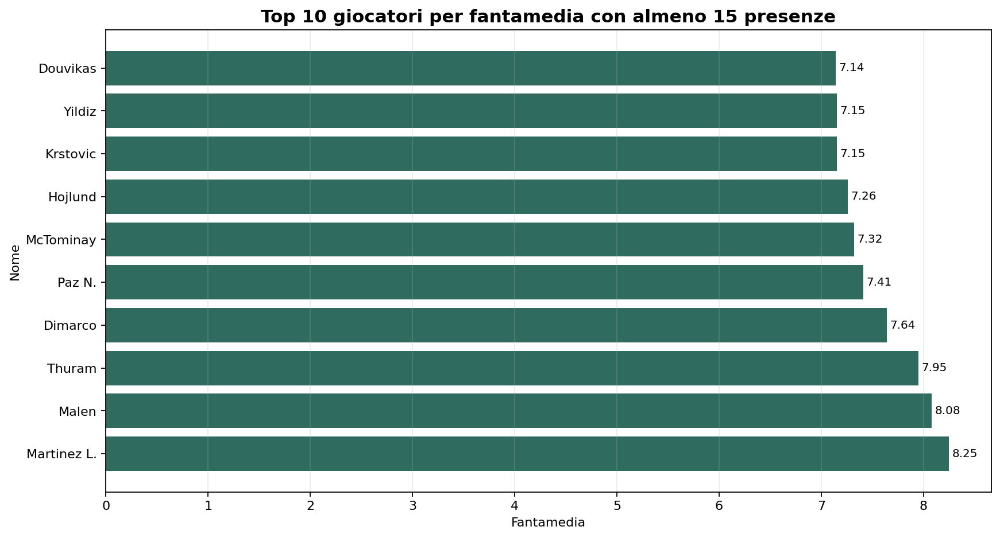
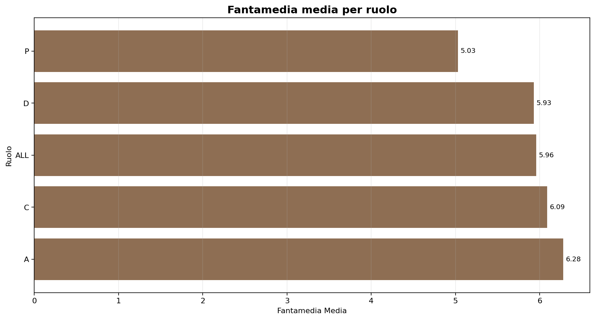
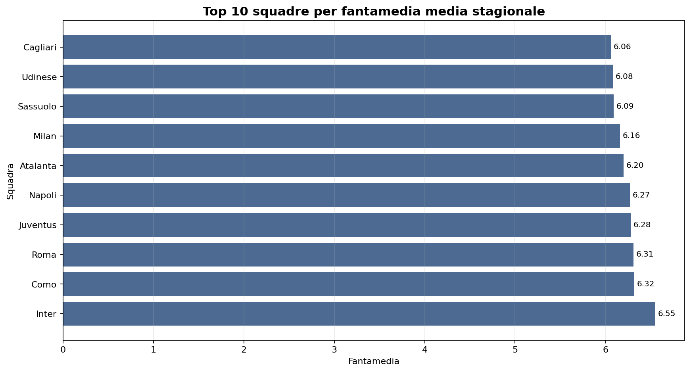
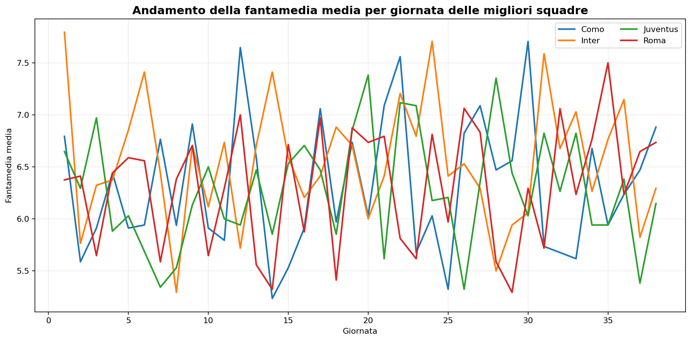

# Report analisi Fantacalcio 2025/2026

## Pulizia e aggregazione

- File elaborati: 38 giornate.
- Righe pulite a livello evento: 12,686.
- Giocatori aggregati nel file finale: 639.
- Squadre presenti: 20.

La pulizia ha normalizzato i voti con asterisco, ha ricostruito il blocco squadra per ogni foglio e ha aggregato i dati per `Squadra + Cod. + Ruolo + Nome`.

## Evidenze principali

### Giocatori piu efficaci

| Squadra | Nome | Ruolo | presenze | fantamedia | gf | ass |
| --- | --- | --- | --- | --- | --- | --- |
| Inter | Martinez L. | A | 30 | 8.25 | 17 | 6 |
| Roma | Malen | A | 18 | 8.08 | 11 | 2 |
| Inter | Thuram | A | 29 | 7.95 | 13 | 6 |
| Inter | Dimarco | D | 35 | 7.64 | 7 | 17 |
| Como | Paz N. | C | 35 | 7.41 | 12 | 5 |
| Napoli | McTominay | C | 33 | 7.32 | 10 | 2 |
| Napoli | Hojlund | A | 33 | 7.26 | 11 | 5 |
| Juventus | Yildiz | A | 36 | 7.15 | 9 | 6 |
| Atalanta | Krstovic | A | 33 | 7.15 | 10 | 5 |
| Como | Douvikas | A | 38 | 7.14 | 13 | 1 |

### Ruoli piu produttivi

| Ruolo | giocatori | fantamedia_media | voto_medio |
| --- | --- | --- | --- |
| A | 130 | 6.28 | 5.97 |
| C | 221 | 6.09 | 5.96 |
| ALL | 30 | 5.96 | 6.01 |
| D | 212 | 5.93 | 5.89 |
| P | 46 | 5.03 | 6.16 |

### Squadre piu forti

| Squadra | presenze | fantamedia | voto_medio |
| --- | --- | --- | --- |
| Inter | 643 | 6.55 | 6.21 |
| Como | 644 | 6.32 | 6.12 |
| Roma | 634 | 6.31 | 6.13 |
| Juventus | 641 | 6.28 | 6.06 |
| Napoli | 622 | 6.27 | 6.07 |
| Atalanta | 637 | 6.20 | 6.04 |
| Milan | 615 | 6.16 | 6.02 |
| Sassuolo | 637 | 6.09 | 6.00 |
| Udinese | 641 | 6.08 | 6.01 |
| Cagliari | 632 | 6.06 | 5.99 |

### Marcatori, assist e malus

| Squadra | Nome | Ruolo | gf | ass | fantamedia |
| --- | --- | --- | --- | --- | --- |
| Inter | Martinez L. | A | 17 | 6 | 8.25 |
| Inter | Thuram | A | 13 | 6 | 7.95 |
| Como | Douvikas | A | 13 | 1 | 7.14 |
| Como | Paz N. | C | 12 | 5 | 7.41 |
| Roma | Malen | A | 11 | 2 | 8.08 |
| Napoli | Hojlund | A | 11 | 5 | 7.26 |
| Torino | Simeone | A | 11 | 0 | 7.09 |
| Napoli | McTominay | C | 10 | 2 | 7.32 |
| Atalanta | Krstovic | A | 10 | 5 | 7.15 |
| Juventus | Yildiz | A | 9 | 6 | 7.15 |

| Squadra | Nome | Ruolo | ass | gf | fantamedia |
| --- | --- | --- | --- | --- | --- |
| Inter | Dimarco | D | 17 | 7 | 7.64 |
| Sassuolo | Laurientè | A | 9 | 7 | 6.96 |
| Inter | Barella | C | 9 | 3 | 6.71 |
| Como | Rodriguez Je. | A | 8 | 2 | 6.60 |
| Roma | Dybala | A | 7 | 2 | 6.80 |
| Inter | Martinez L. | A | 6 | 17 | 8.25 |
| Inter | Thuram | A | 6 | 13 | 7.95 |
| Juventus | Yildiz | A | 6 | 9 | 7.15 |
| Juventus | McKennie | C | 6 | 5 | 6.64 |
| Como | Paz N. | C | 5 | 12 | 7.41 |

| Squadra | Nome | Ruolo | amm | esp | malus_disciplinare | fantamedia |
| --- | --- | --- | --- | --- | --- | --- |
| Como | Ramon | D | 11 | 1 | 6.50 | 6.14 |
| Fiorentina | Pongracic | D | 12 | 0 | 6.00 | 5.67 |
| Cremonese | Pezzella Giu. | D | 8 | 1 | 5.00 | 5.55 |
| Napoli | Juan Jesus | D | 8 | 1 | 5.00 | 5.67 |
| Pisa | Caracciolo A. | D | 10 | 0 | 5.00 | 5.80 |
| Fiorentina | Ranieri L. | D | 8 | 1 | 5.00 | 5.81 |
| Cagliari | Obert | D | 8 | 1 | 5.00 | 5.83 |
| Verona | Gagliardini | C | 10 | 0 | 5.00 | 5.84 |
| Lecce | Ramadani | C | 10 | 0 | 5.00 | 5.85 |
| Genoa | Malinovskyi | C | 10 | 0 | 5.00 | 6.01 |

### Giocatori piu costanti

| team | name | role | presenze | fantamedia | std_fantavoto |
| --- | --- | --- | --- | --- | --- |
| Parma | Valeri | D | 34 | 6.09 | 0.56 |
| Atalanta | Bernasconi | D | 23 | 6.15 | 0.59 |
| Verona | Mosquera | A | 22 | 6.05 | 0.62 |
| Parma | Cuesta | ALL | 38 | 6.04 | 0.65 |
| Cagliari | Pisacane | ALL | 38 | 6.08 | 0.67 |
| Sassuolo | Grosso | ALL | 38 | 6.11 | 0.71 |
| Como | Diego Carlos | D | 27 | 6.09 | 0.72 |
| Roma | Gasperini | ALL | 38 | 6.22 | 0.73 |
| Atalanta | Palladino | ALL | 27 | 6.07 | 0.74 |
| Genoa | De Rossi | ALL | 28 | 6.20 | 0.76 |

## Lettura finale

- La squadra piu solida nel complesso e l'Inter, seguita da Como, Roma, Juventus e Napoli.
- Gli attaccanti sono la fascia con la fantamedia media piu alta, mentre i portieri risultano piu penalizzati in termini di rendimento medio.
- Il peso di gol e assist emerge chiaramente: i profili migliori sono quelli che combinano presenza, bonus offensivi e continuita.
- Alcuni difensori e centrocampisti si distinguono per stabilita, non solo per picchi occasionali.

## Visualizzazioni

