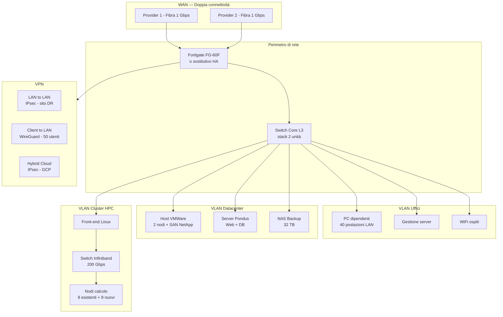

# Progetto Rete TP Group — Sede Unificata Torino

## Topologia di rete

## Schema IP e subnetting

| VLAN | Scopo | Subnet | Gateway | Note |
| --- | --- | --- | --- | --- |
| 10 | Uffici (LAN dipendenti) | 10.10.10.0/24 | 10.10.10.1 | Fino a 254 dispositivi |
| 20 | Management server | 10.10.20.0/24 | 10.10.20.1 | Accesso riservato admin |
| 30 | WiFi guest | 10.10.30.0/24 | 10.10.30.1 | Isolata da rete interna |
| 40 | Datacenter (virtualizzazione) | 10.10.40.0/24 | 10.10.40.1 | Host VMWare + SAN |
| 50 | Pondus (web + db) | 10.10.50.0/24 | 10.10.50.1 | Layer separato |
| 60 | Backup (NAS) | 10.10.60.0/24 | 10.10.60.1 | Isolata per backup |
| 70 | Cluster HPC (Ethernet) | 10.10.70.0/24 | 10.10.70.1 | Front-end + management |
| 80 | Infiniband (HPC) | 192.168.100.0/24 | — | Rete privata Infiniband |
| 90 | VPN LAN to LAN | 10.10.90.0/24 | 10.10.90.1 | Tunnel IPsec sito DR |
| 100 | VPN Hybrid Cloud | 10.10.100.0/24 | 10.10.100.1 | Tunnel IPsec GCP |

## Ridondanza connettività

- **Due provider** distinti su linee fisiche diverse (es. TIM + Fastweb/WindTre)
- **Failover automatico** con SD-WAN o policy-based routing su Fortigate
- **Bilanciamento** attivo/passivo (active/standby) con failover < 30 secondi
- Velocità: 1 Gbps simmetrico per link

## Firewall Fortigate FG-60F: valutazione

| Opzione | Pro | Contro | Costo stimato |
| --- | --- | --- | --- |
| **Mantenere FG-60F** | Nessun costo HW | Spazio saturo, senza HA, throughput limitato (700 Mbps FW) | € 0 |
| **HA cluster (2× FG-60F)** | Ridondanza, zero downtime | 2 unità identiche, throughput non migliora | € 2.000 |
| **Sostituzione FG-100F** | Throughput 2 Gbps, HA nativo, più porte 10GbE | Costo maggiore | € 4.500 |
| **Sostituzione con Fortigate 200F** | Prestazioni elevate, 10GbE, espandibilità | Sovradimensionato per TP Group | € 8.500 |

**Raccomandazione:** Fortigate FG-100F in HA (2 unità). Risolve ridondanza, connettività 10GbE per HPC e supporta VPN IPsec con throughput adeguato.

## Hardware di rete raccomandato

| Apparato | Q.tà | Costo unitario | Totale |
| --- | --- | --- | --- |
| Fortigate FG-100F | 2 | € 4.500 | € 9.000 |
| Switch L3 Core (es. Cisco CBS350-24P-4G) | 2 | € 1.200 | € 2.400 |
| Switch L2 accesso uffici (es. Cisco CBS250-48P) | 2 | € 900 | € 1.800 |
| Access Point WiFi 6 (es. UniFi U6 Pro) | 3 | € 150 | € 450 |
| Patch panel, cablaggio, connettori | 1 lotto | € 1.500 | € 1.500 |
| **Totale hardware rete** | | | **€ 15.150** |

## Costi connettività (mensili)

| Voce | Costo/mese |
| --- | --- |
| Provider 1 (fibra 1 Gbps simm.) | € 120 |
| Provider 2 (fibra 1 Gbps simm.) | € 120 |
| **Totale connettività/mese** | **€ 240** |
