# Schema Logico Rete TP Group

```mermaid
graph TB
    subgraph ESTERNO["Rete Esterna"]
        ISP1[ISP 1 - Fibra 1 Gbps]
        ISP2[ISP 2 - Fibra 1 Gbps]
        REMOTO[Dipendenti<br/>VPN Client to LAN]
        DR[Sito DR<br/>VPN LAN to LAN]
        GCP[Google Cloud<br/>VPN Hybrid Cloud]
        CLIENTI[Clienti Pondus<br/>HTTPS]
    end

    subgraph SEDE["Sede Thema Consulting — Torino"]
        subgraph PERIMETRO["Perimeter"]
            FG1[Fortigate FG-100F<br/>Primary]
            FG2[Fortigate FG-100F<br/>Secondary HA]
            SW1[Switch Core L3<br/>Primary]
            SW2[Switch Core L3<br/>Secondary]
        end

        subgraph UFFICI["VLAN 10 - Uffici (10.10.10.0/24)"]
            PC1[40 postazioni LAN]
        end

        subgraph MGMT["VLAN 20 - Management (10.10.20.0/24)"]
            ADMIN[Server Admin]
        end

        subgraph GUEST_VLAN["VLAN 30 - Guest (10.10.30.0/24)"]
            AP[Access Point WiFi]
        end

        subgraph DATACENTER["VLAN 40 - Datacenter (10.10.40.0/24)"]
            VMWARE1[Host VMWare 1]
            VMWARE2[Host VMWare 2]
            SAN[NetApp SAN 24 TB]
        end

        subgraph PONDUS_VLAN["VLAN 50 - Pondus (10.10.50.0/24)"]
            WEB[Web Server IIS]
            DB[DB Server MS SQL]
        end

        subgraph BACKUP_VLAN["VLAN 60 - Backup (10.10.60.0/24)"]
            NAS[NAS QNAP 32 TB]
        end

        subgraph HPC_ETH["VLAN 70 - HPC Ethernet (10.10.70.0/24)"]
            FE[Front-end Linux]
        end

        subgraph HPC_IB["Rete Infiniband (192.168.100.0/24)"]
            IB_SW[Switch Infiniband 200 Gbps]
            NODE1[Nodo 1]
            NODE2[Nodo 2]
            NODE3[Nodo 3]
            NODE4[Nodo 4]
            NODE5[Nodo 5]
            NODE6[Nodo 6]
            NODE7[Nodo 7]
            NODE8[Nodo 8]
            NODE9[Nodo 9]
            NODE10[Nodo 10]
            NODE11[Nodo 11]
            NODE12[Nodo 12]
            NODE13[Nodo 13]
            NODE14[Nodo 14]
            NODE15[Nodo 15]
            NODE16[Nodo 16]
        end
    end

    ISP1 --> FG1
    ISP2 --> FG1
    ISP1 --> FG2
    ISP2 --> FG2
    FG1 <--> FG2
    FG1 --> SW1
    FG1 --> SW2
    FG2 --> SW1
    FG2 --> SW2
    SW1 <--> SW2

    FG1 --> REMOTO
    FG1 --> DR
    FG1 --> GCP
    FG1 --> CLIENTI

    SW1 --> PC1
    SW1 --> ADMIN
    SW1 --> VMWARE1
    SW1 --> VMWARE2
    SW1 --> SAN
    SW1 --> WEB
    SW1 --> DB
    SW1 --> NAS
    SW1 --> FE
    SW1 --> AP

    FE --> IB_SW
    IB_SW --> NODE1
    IB_SW --> NODE2
    IB_SW --> NODE3
    IB_SW --> NODE4
    IB_SW --> NODE5
    IB_SW --> NODE6
    IB_SW --> NODE7
    IB_SW --> NODE8
    IB_SW --> NODE9
    IB_SW --> NODE10
    IB_SW --> NODE11
    IB_SW --> NODE12
    IB_SW --> NODE13
    IB_SW --> NODE14
    IB_SW --> NODE15
    IB_SW --> NODE16
```

## Legenda connettività

| Tratto | Tecnologia | Velocità |
| --- | --- | --- |
| Sede ↔ ISP | Fibra ottica | 1 Gbps |
| Firewall ↔ Core switch | SFP+ 10GbE | 10 Gbps |
| Core ↔ Accesso uffici | Cat6a | 1 Gbps |
| Core ↔ Datacenter | SFP+ 10GbE | 10 Gbps |
| Core ↔ NAS backup | SFP+ 10GbE | 10 Gbps |
| Front-end HPC ↔ Core | SFP+ 10GbE | 10 Gbps |
| Front-end HPC ↔ Nodi HPC | Infiniband HDR | 200 Gbps |
| VPN Client ↔ Firewall | Internet | Variabile |
