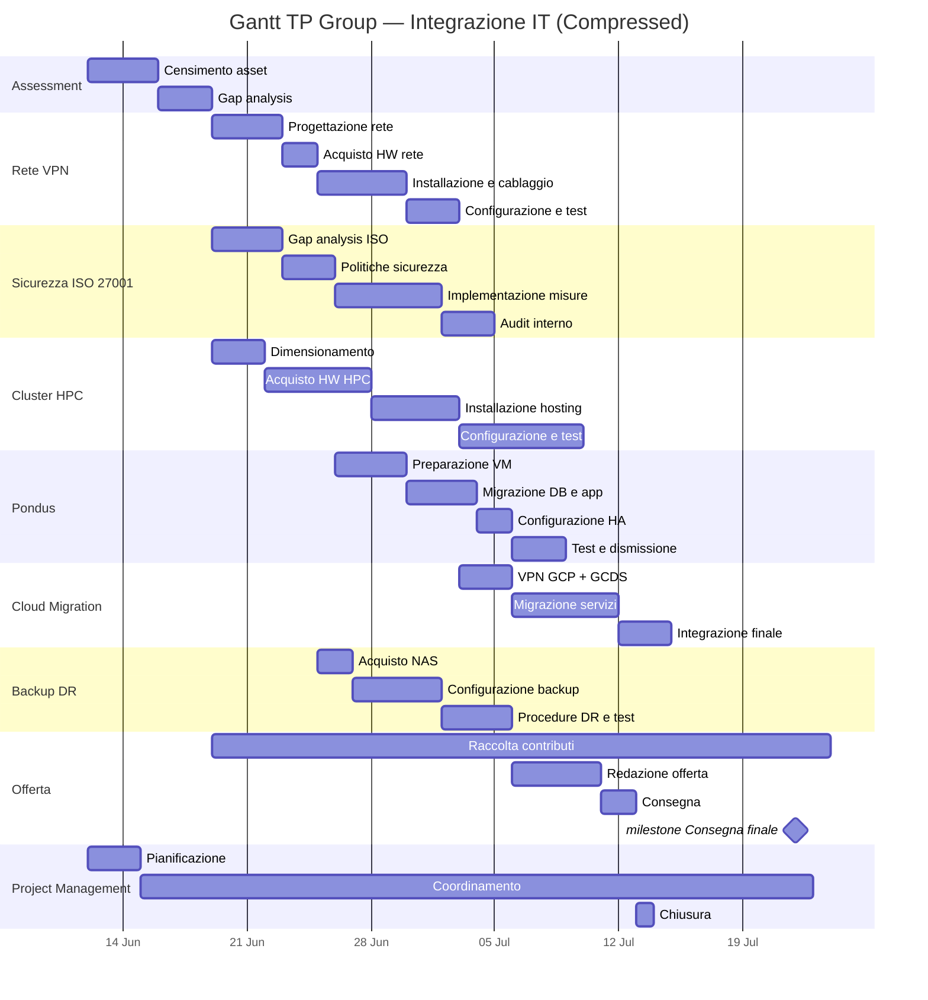

# Gantt di Progetto — TP Group

## Cronoprogramma (12 giu → 22 lug 2026)

## Tabella attività

| # | Attività | Inizio | Fine | Durata | Dipendenza |
| --- | --- | --- | --- | --- | --- |
| 1 | Censimento asset | 12/06 | 15/06 | 4g | — |
| 2 | Gap analysis | 16/06 | 18/06 | 3g | #1 |
| 3 | Progettazione rete | 19/06 | 22/06 | 4g | #2 |
| 4 | Gap analysis ISO 27001 | 19/06 | 22/06 | 4g | #2 |
| 5 | Dimensionamento HPC | 19/06 | 21/06 | 3g | #2 |
| 6 | Acquisto HW rete | 23/06 | 24/06 | 2g | #3 |
| 7 | Politiche sicurezza | 23/06 | 25/06 | 3g | #4 |
| 8 | Acquisto HW HPC | 22/06 | 27/06 | 6g | #5 |
| 9 | Acquisto NAS backup | 25/06 | 26/06 | 2g | #6 |
| 10 | Installazione e cablaggio rete | 25/06 | 29/06 | 5g | #6 |
| 11 | Implementazione misure sicurezza | 26/06 | 01/07 | 6g | #7 |
| 12 | Installazione hosting HPC | 28/06 | 02/07 | 5g | #8 |
| 13 | Configurazione + test rete | 30/06 | 02/07 | 3g | #10 |
| 14 | Preparazione VM Pondus | 29/06 | 02/07 | 4g | #7 |
| 15 | Configurazione backup | 02/07 | 06/07 | 5g | #9 + #11 |
| 16 | Audit sicurezza | 02/07 | 04/07 | 3g | #11 |
| 17 | Migrazione DB e app Pondus | 03/07 | 06/07 | 4g | #14 |
| 18 | Configurazione HPC | 03/07 | 09/07 | 7g | #12 |
| 19 | VPN GCP + GCDS | 03/07 | 05/07 | 3g | #13 |
| 20 | Configurazione HA Pondus | 07/07 | 08/07 | 2g | #17 |
| 21 | Test e dismissione Pondus | 09/07 | 11/07 | 3g | #20 |
| 22 | Migrazione servizi cloud | 06/07 | 11/07 | 6g | #19 |
| 23 | Benchmark HPC | 10/07 | 11/07 | 2g | #18 |
| 24 | Integrazione cloud finale | 12/07 | 14/07 | 3g | #22 |
| 25 | Procedure DR e test | 12/07 | 15/07 | 4g | #15 + #22 |
| 26 | Raccolta contributi offerta | 19/06 | 19/07 | parallela | #2 |
| 27 | Redazione offerta | 16/07 | 20/07 | 5g | #25 |
| 28 | Consegna | 21/07 | 22/07 | 2g | #27 |
| 29 | Chiusura progetto | 22/07 | 22/07 | 1g | #28 |

**Milestone:** Consegna finale — **22 luglio 2026**
