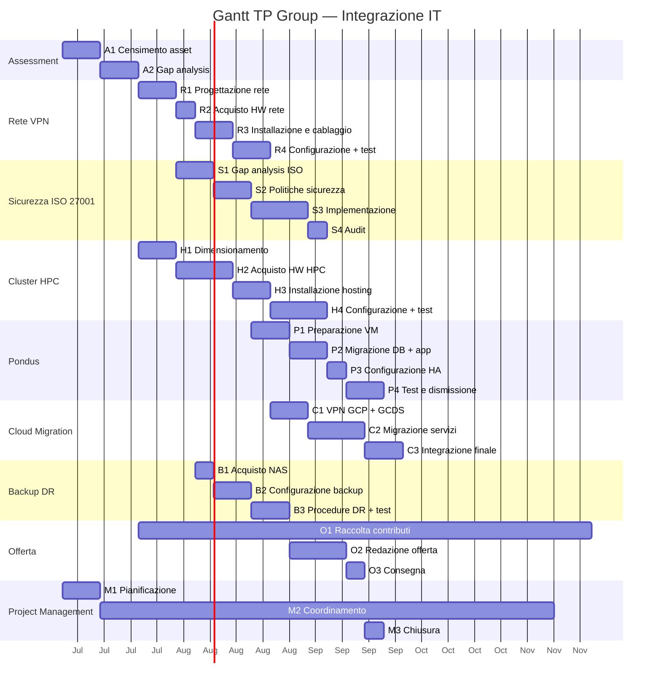

# Gantt di Progetto — TP Group

## Cronoprogramma (6 mesi)

## Tabella attività

| Attività | Inizio | Fine | Durata | Dipendenze |
| --- | --- | --- | --- | --- |
| **Mese 1** | | | | |
| Assessment | G1 | G3 | 20g | — |
| Progettazione rete | G3 | G4 | 10g | Assessment |
| Gap analysis ISO | G3 | G4 | 10g | Progettazione rete |
| Dimensionamento HPC | G3 | G4 | 10g | Assessment |
| **Mese 2** | | | | |
| Acquisto HW rete | G4 | G5 | 5g | Progettazione rete |
| Installazione rete | G5 | G6 | 10g | Acquisto HW rete |
| Politiche sicurezza | G5 | G6 | 10g | Gap analysis ISO |
| Acquisto HPC | G5 | G6 | 15g | Dimensionamento HPC |
| Acquisto NAS backup | G5 | G5 | 5g | Acquisto HW rete |
| **Mese 3** | | | | |
| Configurazione rete | G6 | G7 | 10g | Installazione rete |
| Implementazione sicurezza | G7 | G8 | 15g | Politiche sicurezza |
| Installazione HPC | G7 | G8 | 10g | Acquisto HPC |
| Configurazione backup | G8 | G9 | 10g | Implementazione sicurezza |
| VPN GCP + GCDS | G7 | G8 | 10g | Configurazione rete |
| **Mese 4** | | | | |
| Test rete | G8 | G8 | 5g | Configurazione rete |
| Audit sicurezza | G10 | G10 | 5g | Implementazione sicurezza |
| Configurazione HPC | G9 | G10 | 15g | Installazione HPC |
| Preparazione VM Pondus | G8 | G9 | 10g | Implementazione sicurezza |
| Migrazione servizi cloud | G9 | G10 | 15g | VPN GCP + GCDS |
| **Mese 5** | | | | |
| Benchamark HPC | G11 | G11 | 5g | Configurazione HPC |
| Migrazione Pondus | G10 | G11 | 10g | Preparazione VM |
| HA Pondus + test | G11 | G12 | 15g | Migrazione Pondus |
| Integrazione cloud | G11 | G12 | 10g | Migrazione servizi |
| Procedure DR | G11 | G12 | 10g | Configurazione backup |
| **Mese 6** | | | | |
| Redazione offerta | G13 | G14 | 15g | Tutti completati |
| Consegna e chiusura | G14 | G14 | 5g | Offerta |

**Legenda:** G = mese, es. G1 = inizio mese 1, G3 = fine mese 1
