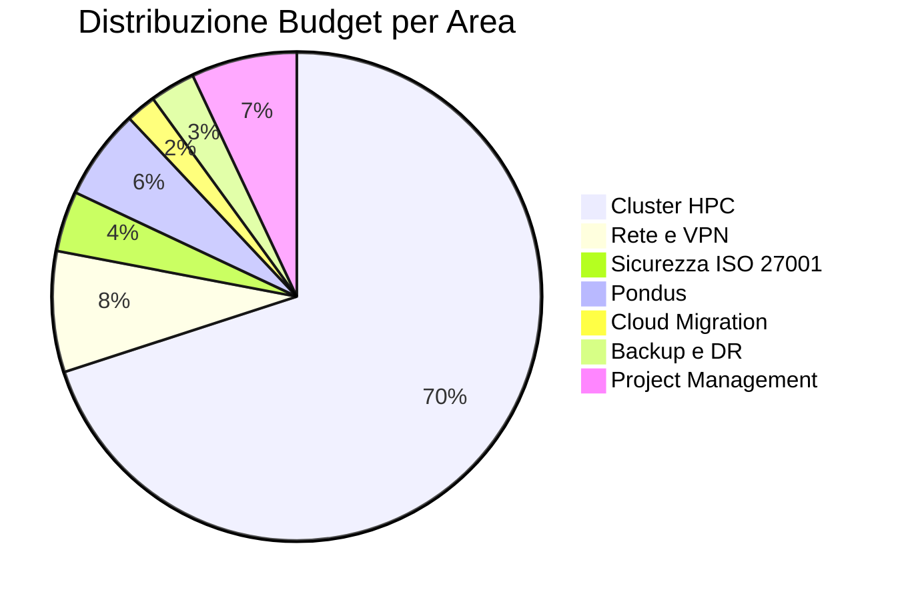

# Piano dei Costi — TP Group

## Budget per area

| Area | Budget assegnato | Spesa prevista | Differenza | Note |
| --- | --- | --- | --- | --- |
| Rete e VPN | € 25.000 | € 22.650 | +€ 2.350 | Sotto budget |
| Sicurezza ISO 27001 | € 15.000 | € 11.500 | +€ 3.500 | Sotto budget |
| Cluster HPC | € 200.000 | € 191.600 | +€ 8.400 | Sotto budget |
| Applicazione Pondus | € 20.000 | € 15.000 | +€ 5.000 | Sotto budget |
| Cloud Migration | € 10.000 | € 5.500 | +€ 4.500 | Sotto budget |
| Backup e DR | € 10.000 | € 7.200 | +€ 2.800 | Sotto budget |
| Project Management | € 20.000 | € 19.500 | +€ 500 | In linea |
| **Totale** | **€ 300.000** | **€ 272.950** | **+€ 27.050** | **Sotto budget** |

## Costi una tantum vs ricorrenti

| Tipologia | Anno 1 | Anno 2 | Anno 3 |
| --- | --- | --- | --- |
| Una tantum | € 272.950 | € 0 | € 0 |
| Ricorrenti | € 21.000 (12 mesi) | € 21.000 | € 21.000 |
| **Totale anno** | **€ 293.950** | **€ 21.000** | **€ 21.000** |
| **Cumulato** | **€ 293.950** | **€ 314.950** | **€ 335.950** |

## Dettaglio costi ricorrenti (mensili)

| Voce | Costo/mese | Annuale |
| --- | --- | --- |
| Doppio provider ISP | € 240 | € 2.880 |
| Co-location HPC | € 800 | € 9.600 |
| FortiGate UTM | € 200 | € 2.400 |
| GCS Nearline 10 TB | € 150 | € 1.800 |
| VM DR su GCP | € 300 | € 3.600 |
| Veeam Backup annuale | € 60 | € 720 |
| **Totale mensile** | **€ 1.750** | **€ 21.000** |

## Distribuzione costi

